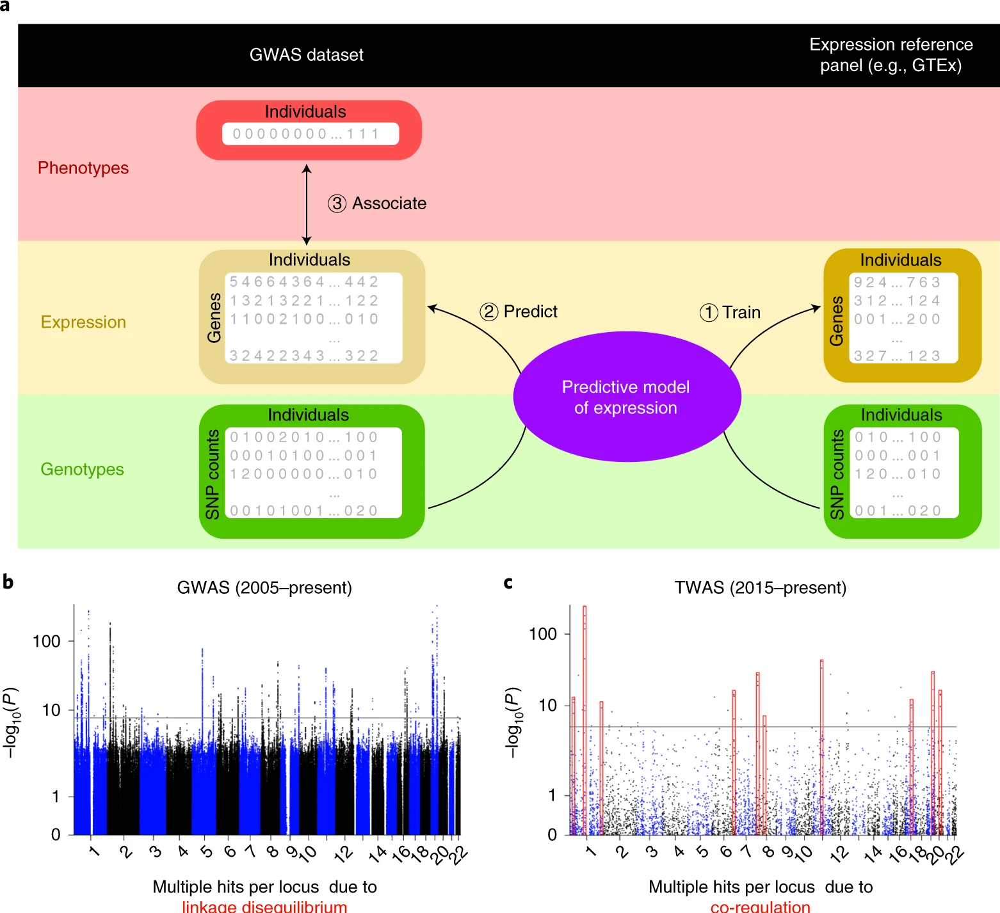
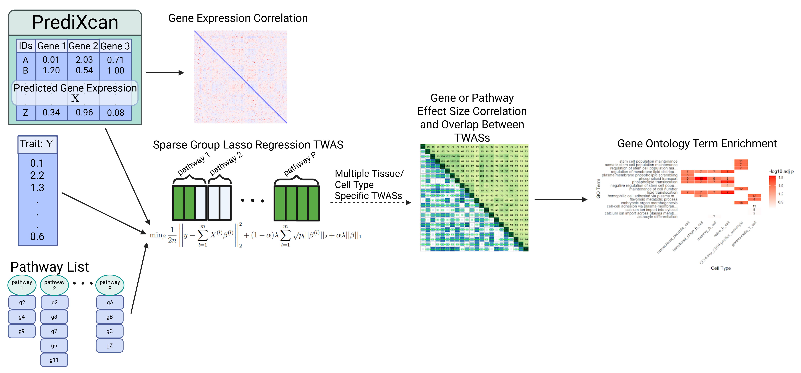

<!-- README.md is generated from README.Rmd. Please edit that file -->

# TWASviz

<!-- badges: start -->

<!-- badges: end -->

The goal of TWASviz is to allow users to perform Transcriptome Wide
Association Studies (TWASs) in R using sparse group lasso, and to import
their own TWAS results and effectively visualize the output. This tool
will also provide functions that visualize the gene expression data, the
overlap of sets of important gene transcripts from multiple cell types
or tissues, and the Gene Ontology term enrichments. Currently, the only
TWAS visualization related R packages make Manhattan plots and focus on
single TWASs at a time (Pain & Anney, 2023). However, with the
development of cell type specific expression-quantitative trait loci and
the importance of understanding the contribution of multiple tissues to
disease, TWASviz provides several heatmap-type visualizations that help
users compare and efficiently present the results of multiple cell type
or tissue specific TWASs at once.

## Background

TWASs are a powerful method for finding gene-trait associations. Simply
associating individuals’ specific single nucleotide polymorphisms (SNPs)
with a complex trait will highlight a lot of SNPs located in non-coding
regions (this is a Genome Wide Association Study). Since non-coding
regions are not transcribed, changes in non-coding regions change
neither the structure nor functionality of the genes’ resulting
proteins. In contrast, TWASs associate gene transcript levels with
phenotypes. This approach more directly implicates specific genes that
functionally impact phenotype. As well, to perform a TWAS, you only need
RNA-seq from a reference panel, and genotype data and phenotype data for
your sample of interest. No need to perform any RNA sequencing on your
sample of interest!

<figure>

<figcaption aria-hidden="true">Figure 1. TWAS overview (Wainberg et al.,
2019).</figcaption>
</figure>

TWASviz is built to be compatible with the TWAS software
[PrediXcan](https://github.com/hakyimlab/MetaXcan/wiki/Individual-level-PrediXcan:-introduction,-tutorials-and-manual).
PrediXcan can do all 3 steps in the above Figure 1a. However, the
association that PrediXcan does is just a naive simple linear regression
of predicted gene expression against phenotype data, one gene at a time.
With TWASviz, PrediXcan is meant to do steps 1. Train and 2. Predict,
and TWASviz does step 3. Associate (via sparse group lasso) and a new
step 4. Visualize! TWASviz supplies functions that are meant to take in
PrediXcan predicted gene expression data, and even has a couple of
functions that are meant to deal directly with PrediXcan TWAS
association results. Since PrediXcan is a very beginner friendly TWAS
software, TWASviz is meant to attract PrediXcan users, invite them to
try a different TWAS framework, and to give them some functions to
produce interesting TWAS summary plots.

## TWASviz Overview

<figure>

<figcaption aria-hidden="true">Figure 2. TWASviz workflow.</figcaption>
</figure>

R version: 4.4.1 (2024-06-14 ucrt) Platform: x86_64-w64-mingw32/x64
Running under: Windows 11 x64 (build 26100)

To install the latest version of the package:

    if (!requireNamespace("devtools")){
       install.packages("devtools")
    }
    library("devtools")
    devtools::install_github("mding010705/TWASviz", build_vignettes = TRUE)
    library(TWASviz)

Please note that it will take a while to build the vignette.

To run the shinyApp:

    TWASviz::run_TWAS_analysis()

Overview:

    ls("package:TWASviz")
    data(package = "TWASviz")
    browseVignettes("TWASviz")

### Available Functions:

*corr_heatmap*- Create a correlation heatmap from feature matrix input.
Designed with many featured gene expression data in-mind. Uses a
parallel backend and allows custom summary function input for down
sampling heatmap pixels to fit a reasonable screen resolution. - uses
packages `grDevices` and `parallel`

*preprocess_expressions_pathways*- Format PrediXcan predicted gene
expression and pathway input to use with `sgl_TWAS` to perform a sparse
group lasso TWAS. - uses the package `data.table`

*sgl_TWAS*- Perform a sparse group lasso TWAS. Input design matrix and
groupings should be from `preprocess_expressions_pathways` or emulate
its output. - uses the package `sparsegl`

*sgl2adj_df*- Create 2 dataframes: one with genes as rows and TWASs as
columns, and one with pathways as rows and TWASs as columns. Takes
coefficient output from one or more `sgl_TWAS` results and aggregates
the gene and pathway effect sizes separately, and merges the results of
these multiple `sgl_TWAS` results. - uses the package `stringr`

*sgl2txt_file*- Write 2 text files: one with a gene column and a betas
column from `sgl_TWAS` aggregated effect sizes, and one with a pathway
column and a betas column from `sgl_TWAS` aggregated effect sizes. Takes
coefficients from only one `sgl_TWAS` result at a time. Allows
`sgl_TWAS` results to be portable. - uses the package `stringr`

*predixcan2adj_df*- Create 1 dataframe: genes as rows and TWASs as
columns. Same format as the gene-oriented `sgl2adj_df` dataframe, except
this function takes in one or more PrediXcan TWAS files to merge. - uses
the package `data.table`

*correlation_overlap_heatmap*- Create a heatmap with 2 components:
correlation of gene/pathway effect sizes between multiple TWASs in the
lower triangle, and the number of shared genes/pathways between multiple
TWASs in the upper triangle. - uses packages `psych`, `ggplot2`,
`dplyr`, `tidyr`, `ggnewscale`, and `magrittr`

*gene_enrichment*- Perform Gene Ontology term enrichment on multiple
gene sets. Produces a list of enrichment results from each gene set. -
uses the package `clusterProfiler`

*goenrich_heatmap*- Create a heatmap of the strength of Gene Ontology
term enrichments across multiple TWASs. Uses output from
`gene_enrichment` or a general list of `enrichResult` objects. - uses
packages `dplyr`, `stringr`, and `ggplot2`

*volcano_plot*- Create a plot of $-\log_{10}(adjusted\ p\text{-}values)$
vs. effect size. Input is ideally gene expression-phenotype association
data from a PrediXcan TWAS. - uses packages `ggplot2`, and `ggrepel`

*run_TWAS_analysis*- Run an R `shiny` app that produces plots from
`volcano_plot`, `correlation_overlap_heatmap`, and `goenrich_heatmap`.
Takes in PrediXcan TWAS result files or the gene-oriented files from
`sgl2txt_file` or the pathway-oriented files from `sgl2txt_file`. No
`volcano_plot` output for files from `sgl2txt_file` because regularized
regressions typically do not have coefficient p-values, and no
`goenrich_heatmap` output for the pathway-oriented files from
`sgl2txt_file` since Gene Ontology Term enrichment is typically done
with gene sets, not pathways. - uses the package `shiny`

## Contributions:

Megan Ding is the package author (conceptualized package, assembled code
for all functions, and wrote tests)

The `sgl_TWAS` function is essentially a wrapper for `cv.sparsegl` by
Liang et al. (2024). The inspiration to use sparse group lasso to
estimate pathway-aware gene effect sizes was inspired by the original
sparse group lasso paper (Simon et al., 2013) that mentions using the
model on gene expression data.

The `corr_heatmap` function is inspired by and uses code by Devailly
(2021).

ChatGPT-5 was used to help generate tests cases and roxygen2-style
documentation for all functions.

The `gene_enrichment` function is essentially a wrapper for `enrichGO`
by Xu et al. (2024).

## References

Aleksander, S. A., Balhoff, J., Carbon, S., Cherry, J. M., Drabkin, H.
J., Ebert, D., Feuermann, M., Gaudet, P., Harris, N. L., Hill, D. P.,
Lee, R., Mi, H., Moxon, S., Mungall, C. J., Muruganugan, A.,
Mushayahama, T., Sternberg, P. W., Thomas, P. D., Van Auken, K., …
Westerfield, M. (2023). The gene ontology knowledgebase in 2023.
GENETICS, 224(1). <https://doi.org/10.1093/genetics/iyad031>

Ashburner, M., Ball, C. A., Blake, J. A., Botstein, D., Butler, H.,
Cherry, J. M., Davis, A. P., Dolinski, K., Dwight, S. S., Eppig, J. T.,
Harris, M. A., Hill, D. P., Issel-Tarver, L., Kasarskis, A., Lewis, S.,
Matese, J. C., Richardson, J. E., Ringwald, M., Rubin, G. M., &
Sherlock, G. (2000). Gene ontology: Tool for the unification of biology.
Nature Genetics, 25(1), 25–29. <https://doi.org/10.1038/75556>

Bache, S., Wickham, H. (2022). magrittr: A Forward-Pipe Operator for R.
R package version 2.0.3. <https://CRAN.R-project.org/package=magrittr>.

Barrett, T., Dowle, M., Srinivasan, A., Gorecki, J., Chirico, M.,
Hocking, T., Schwendinger, B., Krylov, I. (2025). data.table: Extension
of `data.frame`. R package version 1.17.8,
<https://CRAN.R-project.org/package=data.table>.

Bates, D., Maechler, M., Jagan, M. (2025). Matrix: Sparse and Dense
Matrix Classes and Methods. R package version 1.7-4.
<https://CRAN.R-project.org/package=Matrix>.

BioRender.com. BioRender. <https://www.biorender.com> (accessed 3
November 2025)

Campitelli, E. (2025). ggnewscale: Multiple Fill and Colour Scales in
‘ggplot2’. R package version 0.5.2.
<https://CRAN.R-project.org/package=ggnewscale>.

Carlson M (2024). org.Hs.eg.db: Genome wide annotation for Human. R
package version 3.20.0.

Chang, W., Cheng, J., Allaire, J., Sievert, C., Schloerke, B., Xie, Y.,
Allen, J., McPherson, J., Dipert, A., Borges, B. (2025). shiny: Web
Application Framework for R. R package version 1.11.1.
<https://CRAN.R-project.org/package=shiny>.

Devailly, G. (2021, October 14). Plotting heatmaps from big matrices in
R. <https://gdevailly.netlify.app/post/plotting-big-matrices-in-r/>

Diamant, I., Clarke, D. J. B., Evangelista, J. E., Lingam, N., &
Ma’ayan, A. (2024). Harmonizome 3.0: Integrated knowledge about genes
and proteins from diverse multi-omics resources. Nucleic Acids Research,
53(D1). <https://doi.org/10.1093/nar/gkae1080>

Gamazon, E. R., Wheeler, H. E., Shah, K. P., Mozaffari, S. V.,
Aquino-Michaels, K., Carroll, R. J., Eyler, A. E., Denny, J. C.,
Nicolae, D. L., Cox, N. J., & Im, H. K. (2015). A gene-based association
method for mapping traits using reference transcriptome data. Nature
Genetics, 47(9), 1091–1098. <https://doi.org/10.1038/ng.3367>

Kanehisa, M. (2000). Kegg: Kyoto encyclopedia of genes and genomes.
Nucleic Acids Research, 28(1), 27–30.
<https://doi.org/10.1093/nar/28.1.27>

Liang, X., Cohen, A., Solón Heinsfeld, A., Pestilli, F., McDonald, D.J.
(2024). “sparsegl: An R Package for Estimating Sparse Group Lasso.”
Journal of Statistical Software, 110(6), 1-23.
<doi:10.18637/jss.v110.i06>. <https://doi.org/10.18637/jss.v110.i06>.

Milacic, M., Beavers, D., Conley, P., Gong, C., Gillespie, M., Griss,
J., Haw, R., Jassal, B., Matthews, L., May, B., Petryszak, R.,
Ragueneau, E., Rothfels, K., Sevilla, C., Shamovsky, V., Stephan, R.,
Tiwari, K., Varusai, T., Weiser, J., … D’Eustachio, P. (2023). The
reactome pathway knowledgebase 2024. Nucleic Acids Research, 52(D1).
<https://doi.org/10.1093/nar/gkad1025>

OpenAI. (2025). ChatGPT (GPT-5) large language model.
<https://chat.openai.com/> (accessed 28 November 2025)

Pain, O. & Anney, R. (2023) TWAS-plotter.
<https://github.com/opain/TWAS-plotter>

R Core Team (2024). R: A Language and Environment for Statistical
Computing. R Foundation for Statistical Computing, Vienna, Austria.
<https://www.R-project.org/>.

Revelle, W. (2025). psych: Procedures for Psychological, Psychometric,
and Personality Research. Northwestern University, Evanston, Illinois. R
package version 2.5.6, <https://CRAN.R-project.org/package=psych>.

Simon, N., Friedman, J., Hastie, T., & Tibshirani, R. (2013). A
sparse-group lasso. Journal of Computational and Graphical Statistics,
22(2), 231–245. <https://doi.org/10.1080/10618600.2012.681250>

Slowikowski K (2024). ggrepel: Automatically Position Non-Overlapping
Text Labels with ‘ggplot2’. R package version 0.9.6.
<https://CRAN.R-project.org/package=ggrepel>.

Storey, J. D., & Tibshirani, R. (2003). Statistical significance for
genomewide studies. Proceedings of the National Academy of Sciences,
100(16), 9440–9445. <https://doi.org/10.1073/pnas.1530509100>

Tabsets. Shiny. (2014, July 30).
<https://shiny.posit.co/r/gallery/application-layout/tabsets>

Wainberg, M., Sinnott-Armstrong, N., Mancuso, N., Barbeira, A. N.,
Knowles, D. A., Golan, D., Ermel, R., Ruusalepp, A., Quertermous, T.,
Hao, K., Björkegren, J. L., Im, H. K., Pasaniuc, B., Rivas, M. A., &
Kundaje, A. (2019). Opportunities and challenges for transcriptome-wide
association studies. Nature Genetics, 51(4), 592–599.
<https://doi.org/10.1038/s41588-019-0385-z>

Wang, N., Ye, Z., & Ma, T. (2024). Tips: A novel pathway-guided joint
model for transcriptome-wide association studies. Briefings in
Bioinformatics, 25(6). <https://doi.org/10.1093/bib/bbae587>

Wickham, H., François, R., Henry, L., Müller, K., Vaughan, D. (2023).
dplyr: A Grammar of Data Manipulation. R package version 1.1.4.
<https://CRAN.R-project.org/package=dplyr>.

Wickham, H. ggplot2: Elegant Graphics for Data Analysis. Springer-Verlag
New York, 2016.

Wickham, H. (2025). stringr: Simple, Consistent Wrappers for Common
String Operations. R package version 1.6.0.
<https://CRAN.R-project.org/package=stringr>.

Wickham, H., Vaughan, D., Girlich, M. (2024). tidyr: Tidy Messy Data. R
package version 1.3.1. <https://CRAN.R-project.org/package=tidyr>.

Xu, S., Hu, E., Cai, Y., Xie, Z., Luo, X., Zhan, L., Tang, W., Wang, Q.,
Liu, B., Wang, R., Xie, W., Wu, T., Xie, L., Yu, G. Using
clusterProfiler to characterize multiomics data. Nature Protocols. 2024,
19(11):3292-3320.

## Acknowledgements

This package was developed as part of an assessment for 2025 BCB410H:
Applied Bioinformatics course at the University of Toronto, Toronto,
CANADA.

`TWASviz` welcomes issues, enhancement requests, and other
contributions. To submit an issue, use the GitHub issues.
